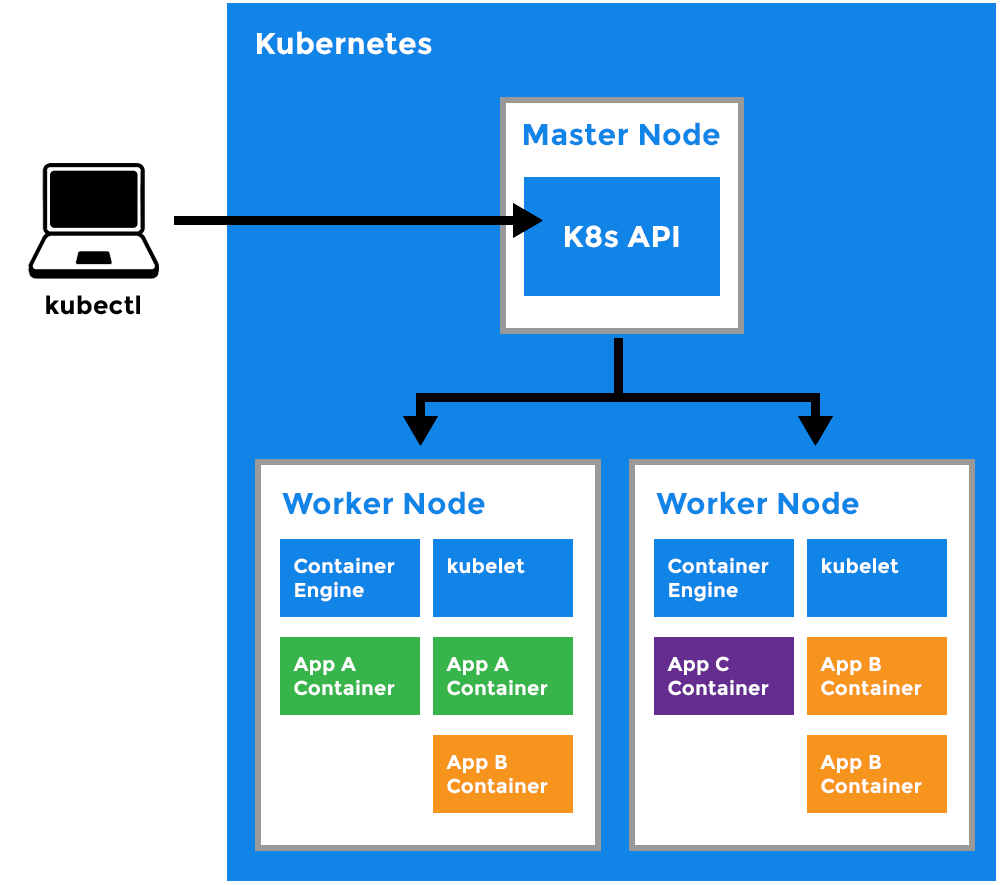

# Introducción a Kubernetes

## ¿Qué es Kubernetes?

Kubernetes, comúnmente abreviado como K8s, es una plataforma de código abierto diseñada para automatizar la implementación, el escalado y la gestión de aplicaciones en contenedores. Desarrollado originalmente por Google y ahora mantenido por la Cloud Native Computing Foundation (CNCF), Kubernetes se ha convertido en el estándar de facto para la orquestación de contenedores en entornos de producción.

### Puntos clave:
- Sistema de orquestación de contenedores de nivel empresarial
- Automatiza tareas complejas relacionadas con la implementación y el escalado de aplicaciones
- Gestiona clusters de hosts en los que se ejecutan contenedores de aplicaciones
- Proporciona un framework para sistemas distribuidos resilientes

## Historia y evolución de Kubernetes

- **Orígenes en Google**: Kubernetes se basa en más de 15 años de experiencia de Google con su sistema interno de orquestación llamado Borg.
- **Lanzamiento como proyecto de código abierto**: Google liberó Kubernetes en 2014, marcando el inicio de una nueva era en la gestión de contenedores.
- **Donación a la CNCF**: En 2015, Google donó Kubernetes a la recién formada Cloud Native Computing Foundation, fomentando un ecosistema neutral y diverso.
- **Rápida adopción**: Desde su lanzamiento, Kubernetes ha experimentado un crecimiento exponencial en adopción y contribuciones de la comunidad.
- **Evolución continua**: Con lanzamientos trimestrales, Kubernetes continúa evolucionando y añadiendo nuevas características para satisfacer las necesidades cambiantes de la industria.

## ¿Por qué usar Kubernetes?

Kubernetes ofrece numerosos beneficios que lo hacen atractivo para organizaciones de todos los tamaños:

1. **Escalabilidad dinámica**: Permite escalar aplicaciones y recursos de manera automática basándose en la demanda.
2. **Portabilidad entre nubes**: Facilita la migración de aplicaciones entre diferentes proveedores de nube o infraestructuras on-premise.
3. **Alta disponibilidad**: Implementa mecanismos para garantizar que las aplicaciones estén siempre disponibles y operativas.
4. **Eficiencia de recursos**: Optimiza el uso de recursos de hardware, mejorando la utilización y reduciendo costos.
5. **Despliegue y rollback automáticos**: Simplifica la implementación de nuevas versiones y permite revertir a versiones anteriores de manera rápida y confiable.
6. **Auto-reparación**: Monitorea constantemente la salud de las aplicaciones y puede reiniciar, reemplazar o reprogramar contenedores que fallan.
7. **Gestión de configuración y secretos**: Ofrece mecanismos seguros para almacenar y gestionar información sensible.
8. **Service discovery y load balancing**: Facilita la comunicación entre servicios y distribuye el tráfico de manera eficiente.
9. **Gestión declarativa**: Permite describir el estado deseado del sistema, y Kubernetes se encarga de mantener ese estado.
10. **Comunidad activa**: Cuenta con una de las comunidades de código abierto más grandes y activas, lo que garantiza soporte continuo y mejoras.

# Conceptos clave y arquitectura

## Clusters de Kubernetes

### ¿Qué es un cluster de Kubernetes y por qué lo necesitamos?

Un cluster de Kubernetes es un conjunto de máquinas, llamadas nodos, que trabajan juntas para ejecutar aplicaciones containerizadas de manera eficiente y escalable. Estos clusters son el corazón de cualquier implementación de Kubernetes y proporcionan el entorno en el que se despliegan, gestionan y escalan las aplicaciones.

### Componentes de un cluster de Kubernetes

Un cluster de Kubernetes típicamente consta de dos tipos principales de nodos:

1. **Nodos maestros (Master Nodes)**: Forman el plano de control del cluster y son responsables de mantener y gestionar el estado del cluster.

2. **Nodos de trabajo (Worker Nodes)**: Estos nodos ejecutan las aplicaciones y cargas de trabajo.

### ¿Por qué necesitamos clusters de Kubernetes?

Los clusters de Kubernetes son esenciales por varias razones:

1. **Escalabilidad**: Los clusters permiten escalar aplicaciones de manera horizontal, añadiendo o eliminando nodos según sea necesario para manejar la carga de trabajo.

2. **Alta disponibilidad**: Al distribuir aplicaciones en múltiples nodos, los clusters pueden mantener las aplicaciones funcionando incluso si algunos nodos fallan.

3. **Eficiencia de recursos**: Kubernetes optimiza el uso de recursos en el cluster, asegurando que los nodos se utilicen de manera eficiente.

4. **Abstracción de la infraestructura**: Los clusters proporcionan una capa de abstracción sobre la infraestructura subyacente, permitiendo a los desarrolladores centrarse en las aplicaciones en lugar de en la gestión de servidores.

5. **Despliegue y gestión consistentes**: Los clusters ofrecen un entorno consistente para desplegar y gestionar aplicaciones, independientemente de la infraestructura subyacente.

6. **Recuperación automática**: Kubernetes puede detectar y reemplazar automáticamente pods fallidos, mejorando la resiliencia de las aplicaciones.

7. **Actualizaciones y rollbacks sin tiempo de inactividad**: Los clusters facilitan las actualizaciones graduales y los rollbacks de aplicaciones sin interrumpir el servicio.

8. **Gestión de la configuración y los secretos**: Kubernetes proporciona mecanismos para gestionar la configuración de las aplicaciones y los datos sensibles de manera segura y escalable.

En resumen, los clusters de Kubernetes son fundamentales para aprovechar al máximo las capacidades de orquestación de contenedores que ofrece Kubernetes. Proporcionan la base necesaria para construir, desplegar y gestionar aplicaciones modernas de manera eficiente, escalable y confiable.

## Opciones para configurar un cluster de Kubernetes

Existen varias formas de configurar un cluster de Kubernetes, cada una adaptada a diferentes necesidades y escenarios:

1. Desarrollo local
2. Clusters gestionados en la nube
3. Clusters on-premise

## Desarrollo local

Para desarrollo y aprendizaje, estas herramientas permiten crear clusters de Kubernetes en tu máquina local:

### Minikube

Minikube ejecuta un cluster de Kubernetes de un solo nodo en tu máquina local.

#### Instalación de Minikube:

```bash
# Linux
curl -LO https://storage.googleapis.com/minikube/releases/latest/minikube-linux-amd64
sudo install minikube-linux-amd64 /usr/local/bin/minikube

# macOS
brew install minikube

# Windows (con Chocolatey)
choco install minikube
```

#### Uso básico de Minikube:

```bash
minikube start
minikube status
minikube stop
minikube delete
```

### kind (Kubernetes in Docker)

kind ejecuta clusters de Kubernetes usando contenedores Docker como "nodos".

#### Instalación de kind:

```bash
# Linux
curl -Lo ./kind https://kind.sigs.k8s.io/dl/v0.11.1/kind-linux-amd64
chmod +x ./kind
sudo mv ./kind /usr/local/bin/kind

# macOS
brew install kind

# Windows (con Chocolatey)
choco install kind
```

#### Uso básico de kind:

```bash
kind create cluster
kind get clusters
kind delete cluster
```

### Docker Desktop

Docker Desktop para Windows y Mac incluye Kubernetes integrado:

1. Abrir Docker Desktop
2. Ir a Preferencias/Configuración
3. En la pestaña Kubernetes, seleccionar "Enable Kubernetes"
4. Aplicar y reiniciar

## Clusters gestionados en la nube

Los proveedores de nube ofrecen servicios de Kubernetes gestionados que simplifican la creación y mantenimiento de clusters.

### Amazon Elastic Kubernetes Service (EKS)

```bash
# Instalar eksctl
curl --silent --location "https://github.com/weaveworks/eksctl/releases/latest/download/eksctl_$(uname -s)_amd64.tar.gz" | tar xz -C /tmp
sudo mv /tmp/eksctl /usr/local/bin

# Crear un cluster
eksctl create cluster --name my-cluster --region us-west-2 --nodes 2
```

### Google Kubernetes Engine (GKE)

```bash
# Configurar el proyecto
gcloud config set project YOUR_PROJECT_ID

# Crear un cluster
gcloud container clusters create my-cluster --num-nodes=2 --zone=us-central1-a
```

### Azure Kubernetes Service (AKS)

```bash
# Crear un grupo de recursos
az group create --name myResourceGroup --location eastus

# Crear un cluster
az aks create --resource-group myResourceGroup --name myAKSCluster --node-count 2
```

## Clusters on-premise

Para entornos on-premise, puedes configurar tu propio cluster usando kubeadm.

### Instalación de kubeadm:

```bash
sudo apt-get update && sudo apt-get install -y apt-transport-https curl
curl -s https://packages.cloud.google.com/apt/doc/apt-key.gpg | sudo apt-key add -
echo "deb https://apt.kubernetes.io/ kubernetes-xenial main" | sudo tee /etc/apt/sources.list.d/kubernetes.list
sudo apt-get update
sudo apt-get install -y kubelet kubeadm kubectl
```

### Inicialización del cluster:

```bash
# En el nodo maestro
sudo kubeadm init

# En los nodos trabajadores
sudo kubeadm join <master-ip>:<master-port> --token <token> --discovery-token-ca-cert-hash sha256:<hash>
```

# Comandos Básicos de kubectl

kubectl es la herramienta de línea de comandos para interactuar con clusters de Kubernetes. Aquí tienes una lista de los comandos más comunes y útiles:

## Información del Cluster

```bash
# Ver información del cluster
kubectl cluster-info

# Ver los nodos del cluster
kubectl get nodes

# Ver todos los recursos en todos los namespaces
kubectl get all --all-namespaces
```

## Pods

```bash
# Listar todos los pods
kubectl get pods

# Listar pods con más detalles
kubectl get pods -o wide

# Describir un pod específico
kubectl describe pod <pod-name>

# Ver los logs de un pod
kubectl logs <pod-name>

# Ejecutar un comando en un pod
kubectl exec -it <pod-name> -- /bin/bash
```

## Deployments

```bash
# Listar todos los deployments
kubectl get deployments

# Crear un deployment desde un archivo YAML
kubectl apply -f <deployment.yaml>

# Escalar un deployment
kubectl scale deployment <deployment-name> --replicas=3

# Actualizar la imagen de un deployment
kubectl set image deployment/<deployment-name> <container-name>=<new-image>

# Ver el estado de un rollout
kubectl rollout status deployment/<deployment-name>

# Revertir un rollout
kubectl rollout undo deployment/<deployment-name>
```

## Services

```bash
# Listar todos los services
kubectl get services

# Exponer un deployment como un service
kubectl expose deployment <deployment-name> --type=LoadBalancer --port=8080
```

## ConfigMaps y Secrets

```bash
# Crear un ConfigMap
kubectl create configmap <configmap-name> --from-file=<path/to/file>

# Crear un Secret
kubectl create secret generic <secret-name> --from-literal=<key>=<value>
```

## Namespaces

```bash
# Listar namespaces
kubectl get namespaces

# Crear un namespace
kubectl create namespace <namespace-name>

# Establecer el namespace preferido
kubectl config set-context --current --namespace=<namespace-name>
```

## Manejo de Contextos

```bash
# Ver los contextos disponibles
kubectl config get-contexts

# Cambiar al contexto deseado
kubectl config use-context <context-name>
```

## Limpieza de Recursos

```bash
# Eliminar un pod
kubectl delete pod <pod-name>

# Eliminar un deployment
kubectl delete deployment <deployment-name>

# Eliminar un service
kubectl delete service <service-name>

# Eliminar todos los recursos en un namespace
kubectl delete all --all -n <namespace-name>
```

## Ayuda

```bash
# Ver la ayuda general de kubectl
kubectl --help

# Ver la ayuda para un comando específico
kubectl <command> --help
```

Recuerda que puedes usar la bandera `-n <namespace>` con la mayoría de estos comandos para especificar un namespace diferente al predeterminado.

## Ejercicio práctico: Creación y exploración de un cluster con Minikube

En este ejercicio, vamos a crear un cluster de Kubernetes usando Minikube y explorar sus componentes para entender mejor qué es un cluster y cómo funciona.

### Paso 1: Iniciar un cluster de Minikube

Primero, vamos a iniciar un cluster de Minikube:

```bash
minikube start
```

Este comando crea un cluster de Kubernetes de un solo nodo en tu máquina local.

### Paso 2: Verificar el estado del cluster

Vamos a verificar que el cluster está funcionando correctamente:

```bash
kubectl cluster-info
```

Deberías ver información sobre la dirección del cluster y del CoreDNS.

### Paso 3: Explorar los nodos del cluster

En un cluster de Kubernetes, los nodos son las máquinas (virtuales o físicas) que ejecutan tus aplicaciones. Vamos a ver los nodos en nuestro cluster:

```bash
kubectl get nodes
```

Deberías ver un solo nodo, ya que Minikube crea un cluster de un solo nodo.

### Paso 4: Explorar los componentes del plano de control

El plano de control de Kubernetes gestiona el estado del cluster. Vamos a ver estos componentes:

```bash
kubectl get pods -n kube-system
```

Aquí verás pods que ejecutan componentes esenciales como:
- etcd: la base de datos del cluster
- kube-apiserver: el servidor API de Kubernetes
- kube-controller-manager: ejecuta los controladores del cluster
- kube-scheduler: asigna pods a nodos

### Paso 5: Desplegar una aplicación de ejemplo

Vamos a desplegar una aplicación simple para ver cómo Kubernetes gestiona las cargas de trabajo:

```bash
kubectl create deployment hello-minikube --image=k8s.gcr.io/echoserver:1.10
```

### Paso 6: Verificar el despliegue

Veamos el estado de nuestro despliegue:

```bash
kubectl get deployments
kubectl get pods
```

Deberías ver un deployment y un pod en estado "Running".

Y finalmente, detener el cluster de Minikube:

```bash
minikube stop
```

## Componentes principales de Kubernetes:



Los componentes de Kubernetes se dividen en dos categorías principales: el Plano de Control (Control Plane) y los Nodos de Trabajo (Worker Nodes). Vamos a explorar cada componente en detalle:

## Plano de Control (Control Plane)

El Plano de Control es el cerebro de Kubernetes, responsable de mantener el estado deseado del cluster, tomar decisiones globales y responder a eventos del cluster.

### 1. API Server

El API Server es el componente central del plano de control de Kubernetes y el único con el que los otros componentes se comunican directamente.

- **Función principal**: Expone la API de Kubernetes, procesando y validando todas las solicitudes REST.
- **Características clave**:
  - Punto de entrada para todas las operaciones administrativas y de orquestación.
  - Implementa un modelo de seguridad basado en autenticación, autorización y control de admisión.
  - Actúa como puente entre varios componentes para mantener el estado del cluster.
- **Importancia**: Permite la comunicación entre todos los componentes y ofrece una interfaz consistente para que los clientes interactúen con el cluster.

### 2. Scheduler

El Scheduler es responsable de asignar pods recién creados a los nodos.

- **Función principal**: Decide en qué nodo se debe ejecutar cada pod.
- **Proceso de decisión**:
  - Considera requisitos de recursos, políticas, afinidad/anti-afinidad, taints/tolerations, y otros factores.
  - Monitorea constantemente la utilización de recursos en los nodos.
- **Importancia**: Asegura una distribución eficiente de las cargas de trabajo en el cluster, optimizando el uso de recursos y respetando las restricciones definidas.

### 3. Controller Manager

El Controller Manager ejecuta varios controladores que regulan el estado del cluster.

- **Función principal**: Mantiene el estado deseado del cluster mediante la ejecución de bucles de control.
- **Tipos de controladores**:
  - Node Controller: Monitorea el estado de los nodos.
  - Replication Controller: Mantiene el número correcto de pods para cada objeto ReplicaSet.
  - Endpoints Controller: Vincula Services y Pods.
  - Service Account & Token Controllers: Crean cuentas y tokens de API por defecto.
- **Importancia**: Asegura que el estado actual del cluster coincida con el estado deseado, realizando acciones correctivas cuando sea necesario.

### 4. etcd

etcd es un almacén de datos distribuido de tipo clave-valor que actúa como la "fuente de verdad" para todos los datos del cluster.

- **Función principal**: Almacena toda la configuración del cluster, estado, y metadatos.
- **Características clave**:
  - Alta disponibilidad y consistencia fuerte.
  - Utiliza el algoritmo de consenso Raft para la replicación.
- **Importancia**: Proporciona un almacenamiento confiable y consistente para todos los datos del cluster, permitiendo la recuperación en caso de fallos.

## Nodos de Trabajo (Worker Nodes)

Los Nodos de Trabajo son las máquinas que ejecutan las aplicaciones y cargas de trabajo containerizadas.

### 1. Kubelet

Kubelet es el agente principal que se ejecuta en cada nodo del cluster.

- **Función principal**: Asegura que los contenedores estén ejecutándose en un Pod.
- **Responsabilidades**:
  - Comunica con el API Server para recibir instrucciones sobre los Pods a ejecutar.
  - Gestiona el ciclo de vida de los contenedores, realizando operaciones como pull de imágenes y ejecución de contenedores.
  - Reporta el estado del nodo y de cada Pod al API Server.
- **Importancia**: Actúa como el enlace entre el plano de control y los contenedores en ejecución, asegurando que el estado deseado se mantenga en cada nodo.

### 2. Kube-proxy

Kube-proxy es un proxy de red que se ejecuta en cada nodo, implementando parte de la abstracción de Service de Kubernetes.

- **Función principal**: Mantiene las reglas de red que permiten la comunicación con los Pods desde dentro o fuera del cluster.
- **Modos de operación**:
  - iptables: Configura reglas de iptables para dirigir el tráfico.
  - IPVS: Utiliza la funcionalidad de IP Virtual Server del kernel de Linux para el balanceo de carga.
- **Importancia**: Facilita la comunicación de red entre diferentes Servicios y Pods, implementando el balanceo de carga para los Servicios.

### 3. Container Runtime

El Container Runtime es el software responsable de ejecutar los contenedores.

- **Función principal**: Gestiona la ejecución y el ciclo de vida de los contenedores.
- **Opciones comunes**:
  - Docker: Ampliamente utilizado, aunque Kubernetes está migrando hacia alternativas más ligeras.
  - containerd: Un runtime más ligero y enfocado, ganando popularidad en Kubernetes.
  - CRI-O: Diseñado específicamente para Kubernetes, compatible con OCI (Open Container Initiative).
- **Importancia**: Proporciona el entorno de ejecución para los contenedores, gestionando aspectos como el aislamiento, la asignación de recursos y la comunicación con el sistema operativo del host.

# Interacciones entre Componentes de Kubernetes

Entender cómo interactúan los diferentes componentes de Kubernetes es crucial para comprender cómo funciona el sistema en su conjunto. Aquí se describen algunas de las interacciones clave:

## 1. API Server como Centro de Comunicación

El API Server actúa como el hub central para todas las comunicaciones en el cluster:

- **Kubelet → API Server**: Los Kubelets en cada nodo se comunican regularmente con el API Server para reportar el estado de los nodos y pods, y para recibir instrucciones sobre qué pods deben estar ejecutándose.

- **Controller Manager → API Server**: Los controladores en el Controller Manager observan constantemente el estado del cluster a través del API Server y realizan acciones para mantener el estado deseado.

- **Scheduler → API Server**: El Scheduler observa los nuevos pods sin nodo asignado a través del API Server y decide en qué nodo deben ejecutarse.

- **etcd ↔ API Server**: El API Server es el único componente que se comunica directamente con etcd, utilizándolo para almacenar y recuperar el estado del cluster.

## 2. Flujo de Creación de un Pod

1. Un usuario o controlador crea un Pod a través del API Server.
2. El API Server almacena la información del Pod en etcd.
3. El Scheduler, observando el API Server, nota el nuevo Pod sin nodo asignado.
4. El Scheduler decide en qué nodo debe ejecutarse el Pod y actualiza la información a través del API Server.
5. El Kubelet del nodo seleccionado, que está constantemente comprobando el API Server, nota que se le ha asignado un nuevo Pod.
6. El Kubelet instruye al Container Runtime para que inicie los contenedores del Pod.
7. El Kubelet informa al API Server sobre el estado del Pod.

## 3. Networking y Services

- **Kube-proxy ↔ API Server**: Kube-proxy observa los cambios en los Services y Endpoints a través del API Server y actualiza las reglas de red en cada nodo.

- **Container Runtime ↔ Kube-proxy**: El tráfico de red de los contenedores pasa por las reglas de red configuradas por Kube-proxy.

## 4. Monitoreo y Recuperación

- **Controller Manager → API Server → Kubelet**: Si el Node Controller en el Controller Manager detecta que un nodo no está respondiendo, puede marcar los Pods en ese nodo como terminados a través del API Server. Los Kubelets en otros nodos pueden entonces ser instruidos para iniciar nuevos Pods para reemplazar los terminados.

## 5. Actualizaciones y Escalado

- **Controller Manager → API Server → Scheduler → Kubelet**: Cuando se actualiza un Deployment, el Deployment Controller en el Controller Manager crea nuevos Pods a través del API Server. El Scheduler asigna estos nuevos Pods a nodos, y los Kubelets en esos nodos los inician.

## 6. Persistencia de Datos

- **Todos los componentes → API Server ↔ etcd**: Cualquier cambio en el estado del cluster (como la creación, actualización o eliminación de recursos) se realiza a través del API Server, que luego persiste estos cambios en etcd.


### Objetos básicos de Kubernetes:

1. **Pods**: La unidad más pequeña y básica en Kubernetes, que encapsula uno o más contenedores.
2. **Services**: Abstracción que define un conjunto lógico de Pods y una política de acceso.
3. **Volumes**: Directorio accesible a los contenedores en un pod, que puede persistir más allá del ciclo de vida de un pod.
4. **Namespaces**: Mecanismo para dividir los recursos del cluster entre múltiples usuarios o proyectos.
5. **Deployments**: Describen el estado deseado para Pods y ReplicaSets, facilitando actualizaciones declarativas.
6. **StatefulSets**: Gestionan el despliegue y escalado de un conjunto de Pods, con garantías sobre el orden y la unicidad.
7. **DaemonSets**: Aseguran que todos (o algunos) nodos ejecuten una copia de un Pod específico.

## Ejercicio 2: Desplegando una aplicación web en Minikube

En este ejercicio, vamos a desplegar una aplicación web simple en un cluster local de Kubernetes usando Minikube. Este proceso nos ayudará a entender los conceptos básicos de Kubernetes en la práctica.

### Paso 1: Instalación de herramientas

Primero, asegúrate de tener instalados Minikube y kubectl. Si no los tienes, sigue estos pasos:

1. Instalar Minikube:
   https://minikube.sigs.k8s.io/docs/start/?arch=%2Fmacos%2Farm64%2Fstable%2Fbinary+download

2. Instalar kubectl:
   https://kubernetes.io/docs/tasks/tools/

### Paso 2: Iniciar Minikube

Inicia tu cluster local de Kubernetes:

```bash
minikube start
```

Verifica que el cluster está funcionando:

```bash
kubectl get nodes
```

### Paso 3: Crear un Deployment

Vamos a crear un Deployment para una aplicación web simple. Crea un archivo llamado `web-deployment.yml` con el siguiente contenido:

```yml
apiVersion: apps/v1
kind: Deployment
metadata:
  name: web-app
spec:
  replicas: 3
  selector:
    matchLabels:
      app: web
  template:
    metadata:
      labels:
        app: web
    spec:
      containers:
      - name: web
        image: nginx:alpine
        ports:
        - containerPort: 80
```

Aplica el Deployment:

```bash
kubectl apply -f web-deployment.yml
```

### Paso 4: Crear un Service

Para exponer nuestra aplicación, creamos un Service. Crea un archivo `web-service.yml`:

```yml
apiVersion: v1
kind: Service
metadata:
  name: web-service
spec:
  selector:
    app: web
  ports:
    - port: 80
      targetPort: 80
  type: NodePort
```

Aplica el Service:

```bash
kubectl apply -f web-service.yml
```

### Paso 5: Verificar el despliegue

Verifica que los Pods están ejecutándose:

```bash
kubectl get pods
```

Obtén la URL de tu servicio:

```bash
minikube service web-service --url
```

Abre esta URL en tu navegador para ver la página por defecto de Nginx.

### Paso 6: Escalar la aplicación

Escala el Deployment a 5 réplicas:

```bash
kubectl scale deployment web-app --replicas=5
```

Verifica que se han creado nuevos Pods:

```bash
kubectl get pods
```

### Paso 7: Actualizar la aplicación

Edita `web-deployment.yml` y cambia `nginx:alpine` a `httpd:alpine`. Luego, aplica los cambios:

```bash
kubectl apply -f web-deployment.yml
```

Observa el proceso de actualización:

```bash
kubectl rollout status deployment/web-app
```

### Paso 8: Limpieza

Cuando hayas terminado, elimina los recursos creados:

```bash
kubectl delete -f web-deployment.yml
kubectl delete -f web-service.yml
```

Detén Minikube:

```bash
minikube stop
```

| [Siguiente --&gt;](2_Objetos.md) |