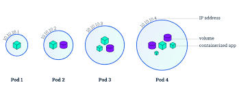
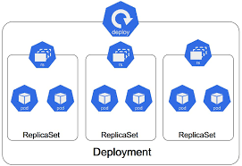
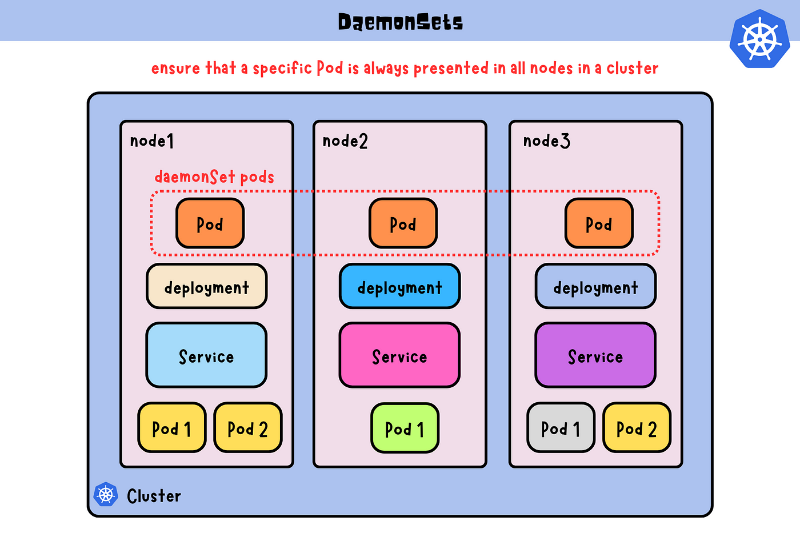

# Objetos de Kubernetes

## Pods



Los Pods son la unidad más básica y fundamental en Kubernetes. Representan un conjunto de uno o más contenedores que se ejecutan juntos en el mismo host y comparten el mismo contexto de red y almacenamiento.

#### Características clave:
- **Unidad atómica**: Los Pods son la unidad más pequeña que se puede crear y gestionar en Kubernetes.
- **Contenedores co-ubicados**: Todos los contenedores en un Pod se ejecutan en el mismo nodo y comparten recursos.
- **Dirección IP compartida**: Todos los contenedores en un Pod comparten una única dirección IP y espacio de puertos.
- **Volúmenes compartidos**: Los contenedores en un Pod pueden compartir volúmenes de almacenamiento.
- **Efímeros**: Los Pods son desechables y pueden ser reemplazados en cualquier momento.

#### Anatomía de un Pod:
1. **Metadata**: Incluye nombre, namespace, etiquetas y anotaciones.
2. **Spec**: Define los contenedores, volúmenes y otras configuraciones del Pod.
3. **Status**: Contiene información sobre el estado actual del Pod, incluyendo condiciones, fase y información de IP.

#### Ciclo de vida de un Pod:
1. Pending: El Pod ha sido aceptado por el cluster, pero uno o más contenedores aún no están configurados.
2. Running: El Pod ha sido vinculado a un nodo, y todos los contenedores han sido creados.
3. Succeeded: Todos los contenedores en el Pod han terminado con éxito y no se reiniciarán.
4. Failed: Todos los contenedores en el Pod han terminado, y al menos uno de los contenedores ha terminado en fallo.
5. Unknown: Por alguna razón, el estado del Pod no puede ser obtenido.

#### Patrones de diseño de Pods:
1. **Sidecar**: Contenedor adicional que mejora o monitorea el contenedor principal.
2. **Ambassador**: Contenedor que representa al contenedor principal para acceder a recursos externos.
3. **Adapter**: Contenedor que estandariza y normaliza la salida del contenedor principal.

## Pods


### Estructura YAML de un Pod

Un archivo YAML para definir un Pod típicamente tiene la siguiente estructura:

```yaml
apiVersion: v1
kind: Pod
metadata:
  name: mi-pod
  labels:
    app: mi-aplicacion
    tier: frontend
  annotations:
    description: "Pod de ejemplo para la documentación"
spec:
  containers:
  - name: contenedor-principal
    image: nginx:1.14.2
    ports:
    - containerPort: 80
    resources:
      limits:
        cpu: "0.5"
        memory: "256Mi"
      requests:
        cpu: "0.2"
        memory: "128Mi"
    env:
    - name: MI_VARIABLE
      value: "mi valor"
    volumeMounts:
    - name: mi-volumen
      mountPath: /data
  volumes:
  - name: mi-volumen
    emptyDir: {}
```

#### Explicación de los campos principales:

1. **apiVersion**: Especifica la versión de la API de Kubernetes que se está utilizando. Para Pods, generalmente es "v1".

2. **kind**: Indica el tipo de objeto que se está definiendo, en este caso "Pod".

3. **metadata**: Contiene información que ayuda a identificar únicamente al Pod.
   - **name**: El nombre del Pod.
   - **labels**: Etiquetas clave-valor para organizar y seleccionar Pods.
   - **annotations**: Metadatos adicionales para herramientas externas o para uso interno.

4. **spec**: Define la configuración deseada del Pod.
   - **containers**: Lista de contenedores en el Pod.
     - **name**: Nombre del contenedor.
     - **image**: Imagen de Docker a utilizar.
     - **ports**: Puertos que el contenedor expone.
     - **resources**: Especifica los recursos (CPU y memoria) que el contenedor necesita.
     - **env**: Variables de entorno para el contenedor.
     - **volumeMounts**: Puntos de montaje para volúmenes en el contenedor.
   - **volumes**: Define los volúmenes que pueden ser montados por los contenedores en el Pod.

#### Campos adicionales opcionales:

- **restartPolicy**: Define cuándo reiniciar el Pod (Always, OnFailure, Never).
- **nodeSelector**: Especifica en qué nodos puede ejecutarse el Pod.
- **affinity**: Reglas más detalladas sobre la ubicación del Pod.
- **tolerations**: Permite que el Pod se ejecute en nodos con taints específicos.
- **initContainers**: Contenedores que se ejecutan antes que los contenedores principales.
- **securityContext**: Configura ajustes de seguridad para el Pod.

### Ejemplos de Casos de Uso Comunes

1. **Pod con múltiples contenedores**:

```yaml
apiVersion: v1
kind: Pod
metadata:
  name: pod-multicontenedor
spec:
  containers:
  - name: contenedor-web
    image: nginx
  - name: contenedor-logger
    image: fluent/fluentd
```

2. **Pod con volumen compartido**:

```yaml
apiVersion: v1
kind: Pod
metadata:
  name: pod-volumen-compartido
spec:
  containers:
  - name: contenedor1
    image: busybox
    volumeMounts:
    - name: shared-data
      mountPath: /data
  - name: contenedor2
    image: busybox
    volumeMounts:
    - name: shared-data
      mountPath: /data
  volumes:
  - name: shared-data
    emptyDir: {}
```

3. **Pod con configuración de recursos**:

```yaml
apiVersion: v1
kind: Pod
metadata:
  name: pod-recursos
spec:
  containers:
  - name: contenedor-principal
    image: nginx
    resources:
      requests:
        memory: "64Mi"
        cpu: "250m"
      limits:
        memory: "128Mi"
        cpu: "500m"
```

### Mejores Prácticas para Definir Pods

1. **Uso de etiquetas**: Utiliza etiquetas significativas para organizar y seleccionar Pods.
2. **Límites de recursos**: Siempre especifica límites de recursos para evitar que un Pod consuma demasiados recursos del nodo.
3. **Seguridad**: Utiliza securityContext para configurar ajustes de seguridad.
4. **Afinidad y anti-afinidad**: Usa reglas de afinidad para controlar la ubicación de los Pods.
5. **Init containers**: Utiliza init containers para tareas de inicialización antes de que se inicien los contenedores principales.

### Ejercicio Práctico: Creación y Manipulación de Pods

#### Objetivo
En este ejercicio, crearemos un Pod, examinaremos su estado y estructura, y realizaremos algunas operaciones básicas.

#### Pasos

1. **Crear un Pod**

   Crea un archivo llamado `mi-pod.yaml` con el siguiente contenido:

   ```yaml
   apiVersion: v1
   kind: Pod
   metadata:
     name: mi-pod
     labels:
       app: mi-app
   spec:
     containers:
     - name: nginx
       image: nginx:1.14.2
       ports:
       - containerPort: 80
     - name: sidecar
       image: busybox
       command: ['sh', '-c', 'while true; do echo "Sidecar running"; sleep 300; done']
   ```

   Aplica el archivo para crear el Pod:

   ```bash
   kubectl apply -f mi-pod.yaml
   ```

2. **Examinar el Pod**

   Verifica que el Pod está en ejecución:

   ```bash
   kubectl get pods
   ```

   Obtén más detalles sobre el Pod:

   ```bash
   kubectl describe pod mi-pod
   ```

3. **Acceder a los logs del contenedor**

   Puedes ver los logs del contenedor nginx:

   ```bash
   kubectl logs mi-pod -c nginx
   ```

   Y los logs del contenedor sidecar:

   ```bash
   kubectl logs mi-pod -c sidecar
   ```

4. **Ejecutar un comando en el contenedor**

   Ejecuta un comando en el contenedor nginx:

   ```bash
   kubectl exec -it mi-pod -c nginx -- /bin/bash
   ```

   Dentro del contenedor, puedes ejecutar:

   ```bash
   echo "Hello from inside the container"
   exit
   ```

5. **Eliminar el Pod**

   Cuando hayas terminado, elimina el Pod:

   ```bash
   kubectl delete pod mi-pod
   ```

### Mejores Prácticas para Pods

1. **Diseño de un solo propósito**: Diseña Pods con un único propósito y evita combinar múltiples aplicaciones no relacionadas en un solo Pod.

2. **Uso de etiquetas**: Utiliza etiquetas para organizar y seleccionar Pods. Las etiquetas permiten una gestión más eficiente de los recursos.

3. **Configuración de pruebas de vida y preparación**: Implementa liveness y readiness probes para mejorar la confiabilidad y garantizar que el tráfico solo se dirija a Pods saludables.

4. **Limitación de recursos**: Define límites de recursos (CPU y memoria) para los contenedores para evitar que un Pod consuma todos los recursos del nodo.

5. **Uso de init containers**: Utiliza init containers para realizar tareas de inicialización antes de que se inicien los contenedores principales del Pod.

6. **Seguridad**: Aplica políticas de seguridad a nivel de Pod, como PodSecurityPolicies, para controlar los privilegios y capacidades de los Pods.

7. **Efimeral por diseño**: Diseña tus aplicaciones asumiendo que los Pods son efímeros y pueden ser reemplazados en cualquier momento.


## Services

Un Service en Kubernetes es una abstracción que define un conjunto lógico de Pods y una política para acceder a ellos. Services permiten que un grupo de Pods sea accesible en la red, ya sea dentro del cluster o externamente.

#### Características clave:

- **Descubrimiento de servicios**: Proporcionan un nombre DNS estable para un conjunto de Pods.
- **Balanceo de carga**: Distribuyen el tráfico entre los Pods asociados.
- **Abstracción de red**: Ocultan la complejidad de la red subyacente y los cambios en los Pods.
- **Exposición de aplicaciones**: Permiten exponer aplicaciones fuera del cluster.

#### Tipos de Services:
1. **ClusterIP**: Expone el Service en una IP interna del cluster. Es el tipo por defecto.
2. **NodePort**: Expone el Service en el mismo puerto de cada nodo seleccionado en el cluster.
3. **LoadBalancer**: Expone el Service externamente usando el balanceador de carga del proveedor de nube.
4. **ExternalName**: Mapea el Service a un nombre DNS externo.

#### Anatomía de un Service:
1. **Metadata**: Incluye nombre, namespace, etiquetas y anotaciones.
2. **Spec**: 
   - `selector`: Define qué Pods son parte del Service.
   - `ports`: Especifica los puertos que el Service expone.
   - `type`: Determina cómo se expone el Service (ClusterIP, NodePort, LoadBalancer, ExternalName).
3. **Status**: Contiene la IP asignada al Service y otra información de estado.


### Estructura YAML de un Service

Un archivo YAML para definir un Service típicamente tiene la siguiente estructura:

```yaml
apiVersion: v1
kind: Service
metadata:
  name: mi-servicio
spec:
  selector:
    app: mi-app
  ports:
    - protocol: TCP
      port: 80
      targetPort: 9376
  type: ClusterIP
```

### Explicación de los campos principales:

1. **apiVersion**: Especifica la versión de la API de Kubernetes. Para Services, es "v1".

2. **kind**: Indica el tipo de objeto, en este caso "Service".

3. **metadata**: Contiene información para identificar únicamente al Service.
   - **name**: El nombre del Service.

4. **spec**: Define la configuración deseada del Service.
   - **selector**: Define qué Pods serán expuestos por este Service.
   - **ports**: Especifica los puertos que el Service expondrá.
   - **type**: Define el tipo de Service (ClusterIP, NodePort, LoadBalancer, ExternalName).

### Campos adicionales opcionales:

- **externalIPs**: Lista de IPs externas a las que debe enrutar el Service.
- **sessionAffinity**: Define si las solicitudes del mismo cliente se redirigen al mismo Pod.
- **clusterIP**: IP asignada al Service dentro del cluster.

### Ejemplos de Casos de Uso Comunes

1. **Service de tipo ClusterIP para comunicación interna**:

```yaml
apiVersion: v1
kind: Service
metadata:
  name: backend
spec:
  selector:
    app: backend
  ports:
    - protocol: TCP
      port: 80
      targetPort: 8080
  type: ClusterIP
```

2. **Service de tipo NodePort para exposición externa**:

```yaml
apiVersion: v1
kind: Service
metadata:
  name: frontend
spec:
  selector:
    app: frontend
  ports:
    - protocol: TCP
      port: 80
      targetPort: 5000
      nodePort: 30007
  type: NodePort
```

3. **Service de tipo LoadBalancer para exposición en la nube**:

```yaml
apiVersion: v1
kind: Service
metadata:
  name: my-service
spec:
  selector:
    app: my-app
  ports:
    - protocol: TCP
      port: 80
      targetPort: 9376
  type: LoadBalancer
```

4. **Service de tipo ExternalName para mapeo a un nombre DNS externo**:

```yaml
apiVersion: v1
kind: Service
metadata:
  name: my-service
  namespace: prod
spec:
  type: ExternalName
  externalName: my.database.example.com
```

### Ejercicio Práctico: Creación y Manipulación de Services

#### Objetivo
En este ejercicio, crearemos diferentes tipos de Services para una aplicación web simple y exploraremos cómo interactúan con los Pods.

#### Pasos

1. **Crear un Deployment para nuestra aplicación**

Crea un archivo llamado `web-deployment.yaml`:

```yaml
apiVersion: apps/v1
kind: Deployment
metadata:
  name: web-app
spec:
  replicas: 3
  selector:
    matchLabels:
      app: web
  template:
    metadata:
      labels:
        app: web
    spec:
      containers:
      - name: web
        image: nginx:1.14.2
        ports:
        - containerPort: 80
```

Aplica el Deployment:

```bash
kubectl apply -f web-deployment.yaml
```

2. **Crear un Service de tipo ClusterIP**

Crea un archivo llamado `clusterip-service.yaml`:

```yaml
apiVersion: v1
kind: Service
metadata:
  name: web-clusterip
spec:
  selector:
    app: web
  ports:
    - protocol: TCP
      port: 80
      targetPort: 80
```

Aplica el Service:

```bash
kubectl apply -f clusterip-service.yaml
```

Verifica la creación del Service:

```bash
kubectl get services
kubectl describe service web-clusterip
```

3. **Crear un Service de tipo NodePort**

Crea un archivo llamado `nodeport-service.yaml`:

```yaml
apiVersion: v1
kind: Service
metadata:
  name: web-nodeport
spec:
  type: NodePort
  selector:
    app: web
  ports:
    - protocol: TCP
      port: 80
      targetPort: 80
```

Aplica el Service:

```bash
kubectl apply -f nodeport-service.yaml
```

Verifica la creación del Service:

```bash
kubectl get services
kubectl describe service web-nodeport
```

4. **Crear un Service de tipo LoadBalancer**

Nota: Este tipo de Service requiere un proveedor de nube que soporte balanceadores de carga externos.

Crea un archivo llamado `loadbalancer-service.yaml`:

```yaml
apiVersion: v1
kind: Service
metadata:
  name: web-loadbalancer
spec:
  type: LoadBalancer
  selector:
    app: web
  ports:
    - protocol: TCP
      port: 80
      targetPort: 80
```

Aplica el Service:

```bash
kubectl apply -f loadbalancer-service.yaml
```

Verifica la creación del Service:

```bash
kubectl get services
kubectl describe service web-loadbalancer
```

5. **Probar los Services**

Para el Service ClusterIP:
```bash
kubectl run -it --rm --restart=Never alpine --image=alpine -- sh
/ # apk add --no-cache curl
/ # curl web-clusterip
```

Para el Service NodePort (asumiendo que estás usando minikube):
```bash
minikube service web-nodeport --url
```

Luego, abre la URL proporcionada en tu navegador.

Para el Service LoadBalancer (si estás en un proveedor de nube):
```bash
kubectl get services web-loadbalancer
```
Usa la IP externa proporcionada para acceder al servicio.

6. **Limpiar**

Elimina todos los recursos creados:

```bash
kubectl delete -f web-deployment.yaml
kubectl delete -f clusterip-service.yaml
kubectl delete -f nodeport-service.yaml
kubectl delete -f loadbalancer-service.yaml
```

### Mejores Prácticas para Services

1. **Uso de selectores**: Utiliza selectores de etiquetas precisos para asociar los Services con los Pods correctos.

2. **Nombrado consistente**: Usa un esquema de nombrado consistente para tus Services para facilitar la gestión.

3. **Exposición mínima**: Utiliza ClusterIP para servicios internos y expón externamente solo cuando sea necesario.

4. **Uso de anotaciones**: Aprovecha las anotaciones para configuraciones específicas del proveedor de nube.

5. **Monitoreo**: Implementa monitoreo para tus Services para detectar problemas de conectividad o balanceo de carga.

6. **Seguridad**: Utiliza NetworkPolicies junto con Services para controlar el tráfico de red.

7. **Pruebas de conectividad**: Realiza pruebas regulares para asegurar que los Services están funcionando correctamente.

8. **Documentación**: Documenta el propósito y las dependencias de cada Service en tu aplicación.

## ReplicaSets



Un ReplicaSet es un objeto de Kubernetes que asegura que un número específico de réplicas de un Pod esté ejecutándose en todo momento. Proporciona capacidades de auto-reparación y escalado horizontal para los Pods.

#### Características clave:
- **Mantenimiento de réplicas**: Garantiza que el número deseado de Pods esté siempre en ejecución.
- **Selector de etiquetas**: Utiliza selectores para identificar los Pods que gestiona.
- **Plantilla de Pod**: Define la especificación de los Pods que creará.
- **Escalabilidad**: Permite aumentar o disminuir fácilmente el número de réplicas.
- **Auto-reparación**: Si un Pod falla o es eliminado, el ReplicaSet creará uno nuevo para mantener el número deseado.

#### Anatomía de un ReplicaSet:
1. **Metadata**: Incluye nombre, namespace, etiquetas y anotaciones.
2. **Spec**: 
   - `replicas`: Número deseado de Pods.
   - `selector`: Define cómo el ReplicaSet identifica los Pods a gestionar.
   - `template`: Plantilla para crear nuevos Pods.
3. **Status**: Contiene información sobre el estado actual del ReplicaSet, incluyendo el número de réplicas actuales.

#### Funcionamiento de un ReplicaSet:
1. El ReplicaSet monitorea constantemente el estado de los Pods que coinciden con su selector.
2. Si el número de Pods es menor que el número deseado, crea nuevos Pods basados en la plantilla.
3. Si el número de Pods es mayor que el deseado, elimina los Pods excedentes.
4. Si un Pod falla o es eliminado, el ReplicaSet crea uno nuevo para reemplazarlo.

#### Casos de uso:
- Mantener un conjunto estable de Pods replicados ejecutándose en todo momento.
- Garantizar la disponibilidad de un número específico de Pods idénticos.
- Escalar horizontalmente una aplicación aumentando el número de réplicas.

### Estructura YAML de un ReplicaSet

Un archivo YAML para definir un ReplicaSet típicamente tiene la siguiente estructura:

```yaml
apiVersion: apps/v1
kind: ReplicaSet
metadata:
  name: mi-replicaset
  labels:
    app: mi-aplicacion
    tier: backend
spec:
  replicas: 3
  selector:
    matchLabels:
      app: mi-aplicacion
  template:
    metadata:
      labels:
        app: mi-aplicacion
    spec:
      containers:
      - name: mi-contenedor
        image: nginx:1.14.2
        ports:
        - containerPort: 80
        resources:
          limits:
            cpu: "0.5"
            memory: "256Mi"
          requests:
            cpu: "0.2"
            memory: "128Mi"
```

### Explicación de los campos principales:

1. **apiVersion**: Especifica la versión de la API de Kubernetes que se está utilizando. Para ReplicaSets, es "apps/v1".

2. **kind**: Indica el tipo de objeto que se está definiendo, en este caso "ReplicaSet".

3. **metadata**: Contiene información que ayuda a identificar únicamente al ReplicaSet.
   - **name**: El nombre del ReplicaSet.
   - **labels**: Etiquetas clave-valor para organizar y seleccionar ReplicaSets.

4. **spec**: Define la configuración deseada del ReplicaSet.
   - **replicas**: Número deseado de réplicas de Pods.
   - **selector**: Define cómo el ReplicaSet identifica qué Pods gestionar.
     - **matchLabels**: Etiquetas que deben coincidir con las de los Pods.
   - **template**: Plantilla para los Pods que el ReplicaSet creará.
     - **metadata**: Metadatos para los Pods creados.
     - **spec**: Especificación de los Pods, incluyendo los contenedores.

### Campos adicionales opcionales:

- **minReadySeconds**: Tiempo mínimo que un Pod nuevo debe estar listo sin ningún contenedor fallando para considerarse disponible.
- **progressDeadlineSeconds**: Tiempo máximo para que el ReplicaSet progrese antes de que se considere fallido.

### Ejemplo de Casos de Uso Comunes

1. **ReplicaSet con múltiples réplicas**:

```yaml
apiVersion: apps/v1
kind: ReplicaSet
metadata:
  name: frontend
spec:
  replicas: 5
  selector:
    matchLabels:
      tier: frontend
  template:
    metadata:
      labels:
        tier: frontend
    spec:
      containers:
      - name: php-redis
        image: gcr.io/google_samples/gb-frontend:v3
```

### Ejercicio Práctico: Creación y Manipulación de ReplicaSets

#### Objetivo
En este ejercicio, crearemos un ReplicaSet, examinaremos su comportamiento y realizaremos operaciones de escalado.

#### Pasos

1. **Crear un ReplicaSet**

   Crea un archivo llamado `mi-replicaset.yaml` con el siguiente contenido:

   ```yaml
   apiVersion: apps/v1
   kind: ReplicaSet
   metadata:
     name: mi-replicaset
   spec:
     replicas: 3
     selector:
       matchLabels:
         app: mi-app
     template:
       metadata:
         labels:
           app: mi-app
       spec:
         containers:
         - name: nginx
           image: nginx:1.14.2
           ports:
           - containerPort: 80
   ```

   Aplica el archivo para crear el ReplicaSet:

   ```bash
   kubectl apply -f mi-replicaset.yaml
   ```

2. **Examinar el ReplicaSet**

   Verifica que el ReplicaSet está en ejecución:

   ```bash
   kubectl get replicasets
   ```

   Obtén más detalles sobre el ReplicaSet:

   ```bash
   kubectl describe replicaset mi-replicaset
   ```

3. **Verificar los Pods creados**

   Lista los Pods creados por el ReplicaSet:

   ```bash
   kubectl get pods -l app=mi-app
   ```

4. **Escalar el ReplicaSet**

   Escala el ReplicaSet a 5 réplicas:

   ```bash
   kubectl scale replicaset mi-replicaset --replicas=5
   ```

   Verifica que ahora hay 5 Pods:

   ```bash
   kubectl get pods -l app=mi-app
   ```

5. **Probar la auto-reparación**

   Elimina uno de los Pods:

   ```bash
   kubectl delete pod <nombre-de-un-pod>
   ```

   Observa cómo el ReplicaSet crea automáticamente un nuevo Pod:

   ```bash
   kubectl get pods -l app=mi-app
   ```

6. **Eliminar el ReplicaSet**

   Cuando hayas terminado, elimina el ReplicaSet:

   ```bash
   kubectl delete replicaset mi-replicaset
   ```

### Mejores Prácticas para ReplicaSets

1. **Uso de Deployments**: En la mayoría de los casos, es mejor usar Deployments que gestionan ReplicaSets, ya que ofrecen capacidades adicionales como actualizaciones rolling y rollbacks.

2. **Etiquetas precisas**: Asegúrate de que los selectores de etiquetas sean precisos para evitar conflictos con otros controladores.

3. **No modificar directamente**: Evita modificar los Pods creados por un ReplicaSet directamente, ya que el ReplicaSet los reemplazará para mantener el estado deseado.

4. **Recursos adecuados**: Configura los recursos (CPU, memoria) adecuadamente en la plantilla de Pod para garantizar que los Pods tengan los recursos necesarios.

5. **Monitoreo**: Implementa un sistema de monitoreo para seguir el estado y rendimiento de tus ReplicaSets y los Pods que gestionan.

6. **Actualización de imágenes**: Para actualizar la imagen de los contenedores, es mejor actualizar el Deployment que gestiona el ReplicaSet, en lugar de modificar el ReplicaSet directamente.

7. **Uso de Probes**: Incluye liveness y readiness probes en la plantilla de Pod para mejorar la confiabilidad y la capacidad de auto-reparación.

## Deployments

Un Deployment es un objeto de Kubernetes que proporciona actualizaciones declarativas para Pods y ReplicaSets. Los Deployments permiten describir el ciclo de vida deseado de una aplicación, incluyendo qué imágenes usar, el número de Pods que deben ejecutarse y cómo deben actualizarse.

#### Características clave:
- **Actualizaciones declarativas**: Describe el estado deseado y Kubernetes se encarga de alcanzarlo.
- **Historial de revisiones**: Mantiene un historial de despliegues que permite rollbacks fáciles.
- **Pausa y reanudación**: Permite pausar y reanudar un despliegue para realizar múltiples actualizaciones.
- **Estrategias de actualización**: Soporta diferentes estrategias como RollingUpdate y Recreate.
- **Gestión de ReplicaSets**: Crea y gestiona ReplicaSets automáticamente.
- **Escalabilidad**: Permite escalar fácilmente el número de réplicas.

#### Anatomía de un Deployment:
1. **Metadata**: Incluye nombre, namespace, etiquetas y anotaciones.
2. **Spec**: 
   - `replicas`: Número deseado de Pods.
   - `selector`: Define cómo el Deployment identifica los Pods a gestionar.
   - `template`: Plantilla para crear nuevos Pods.
   - `strategy`: Define cómo se realizarán las actualizaciones (RollingUpdate o Recreate).
3. **Status**: Contiene información sobre el estado actual del Deployment, incluyendo condiciones, observedGeneration, y detalles sobre el rollout.

#### Estrategias de actualización:
1. **RollingUpdate**: Actualiza los Pods de forma gradual, manteniendo la aplicación disponible durante la actualización.
2. **Recreate**: Termina todos los Pods existentes antes de crear nuevos, lo que resulta en tiempo de inactividad pero es útil cuando la aplicación no soporta múltiples versiones en ejecución simultánea.

#### Casos de uso:
- Despliegue de aplicaciones sin estado.
- Actualizaciones controladas y graduales de aplicaciones.
- Rollbacks rápidos a versiones anteriores en caso de problemas.
- Pausar y reanudar actualizaciones para pruebas A/B o despliegues canary.

### Estructura YAML de un Deployment

Un archivo YAML para definir un Deployment típicamente tiene la siguiente estructura:

```yaml
apiVersion: apps/v1
kind: Deployment
metadata:
  name: mi-deployment
  labels:
    app: mi-aplicacion
spec:
  replicas: 3
  selector:
    matchLabels:
      app: mi-aplicacion
  template:
    metadata:
      labels:
        app: mi-aplicacion
    spec:
      containers:
      - name: mi-contenedor
        image: nginx:1.14.2
        ports:
        - containerPort: 80
        resources:
          limits:
            cpu: "0.5"
            memory: "256Mi"
          requests:
            cpu: "0.2"
            memory: "128Mi"
  strategy:
    type: RollingUpdate
    rollingUpdate:
      maxSurge: 1
      maxUnavailable: 1
```

### Explicación de los campos principales:

1. **apiVersion**: Especifica la versión de la API de Kubernetes. Para Deployments, es "apps/v1".

2. **kind**: Indica el tipo de objeto, en este caso "Deployment".

3. **metadata**: Contiene información para identificar únicamente al Deployment.
   - **name**: El nombre del Deployment.
   - **labels**: Etiquetas para organizar y seleccionar Deployments.

4. **spec**: Define la configuración deseada del Deployment.
   - **replicas**: Número deseado de réplicas de Pods.
   - **selector**: Define cómo el Deployment identifica qué Pods gestionar.
   - **template**: Plantilla para los Pods que el Deployment creará.
   - **strategy**: Define cómo se realizarán las actualizaciones de los Pods.

### Campos adicionales opcionales:

- **minReadySeconds**: Tiempo mínimo antes de considerar un Pod como listo.
- **revisionHistoryLimit**: Número de ReplicaSets antiguos a retener para permitir rollbacks.
- **paused**: Si está en true, pausa el Deployment.

### Ejemplos de Casos de Uso Comunes

1. **Deployment con estrategia de actualización personalizada**:

```yaml
apiVersion: apps/v1
kind: Deployment
metadata:
  name: frontend
spec:
  replicas: 5
  selector:
    matchLabels:
      app: frontend
  template:
    metadata:
      labels:
        app: frontend
    spec:
      containers:
      - name: nginx
        image: nginx:1.14.2
  strategy:
    type: RollingUpdate
    rollingUpdate:
      maxSurge: 2
      maxUnavailable: 1
```

2. **Deployment con sondas de salud**:

```yaml
apiVersion: apps/v1
kind: Deployment
metadata:
  name: backend
spec:
  replicas: 3
  selector:
    matchLabels:
      app: backend
  template:
    metadata:
      labels:
        app: backend
    spec:
      containers:
      - name: node-app
        image: my-node-app:v1.2.3
        ports:
        - containerPort: 3000
        readinessProbe:
          httpGet:
            path: /healthz
            port: 3000
          initialDelaySeconds: 10
          periodSeconds: 5
        livenessProbe:
          httpGet:
            path: /healthz
            port: 3000
          initialDelaySeconds: 15
          periodSeconds: 10
```

### Ejercicio Práctico: Creación y Manipulación de Deployments

#### Objetivo
En este ejercicio, crearemos un Deployment, realizaremos una actualización, escalaremos la aplicación y haremos un rollback.

#### Pasos

1. **Crear un Deployment**

   Crea un archivo llamado `mi-deployment.yaml` con el siguiente contenido:

   ```yaml
   apiVersion: apps/v1
   kind: Deployment
   metadata:
     name: mi-deployment
   spec:
     replicas: 3
     selector:
       matchLabels:
         app: mi-app
     template:
       metadata:
         labels:
           app: mi-app
       spec:
         containers:
         - name: nginx
           image: nginx:1.14.2
           ports:
           - containerPort: 80
   ```

   Aplica el archivo para crear el Deployment:

   ```bash
   kubectl apply -f mi-deployment.yaml
   ```

2. **Examinar el Deployment**

   Verifica que el Deployment está en ejecución:

   ```bash
   kubectl get deployments
   ```

   Obtén más detalles sobre el Deployment:

   ```bash
   kubectl describe deployment mi-deployment
   ```

3. **Actualizar el Deployment**

   Actualiza la imagen de nginx a la versión 1.16.1:

   ```bash
   kubectl set image deployment/mi-deployment nginx=nginx:1.16.1
   ```

   Observa el proceso de actualización:

   ```bash
   kubectl rollout status deployment/mi-deployment
   ```

4. **Escalar el Deployment**

   Escala el Deployment a 5 réplicas:

   ```bash
   kubectl scale deployment mi-deployment --replicas=5
   ```

   Verifica que ahora hay 5 Pods:

   ```bash
   kubectl get pods -l app=mi-app
   ```

5. **Realizar un rollback**

   Si algo sale mal, puedes hacer un rollback a la versión anterior:

   ```bash
   kubectl rollout undo deployment/mi-deployment
   ```

   Verifica el estado del rollback:

   ```bash
   kubectl rollout status deployment/mi-deployment
   ```

6. **Ver el historial de revisiones**

   Puedes ver el historial de revisiones del Deployment:

   ```bash
   kubectl rollout history deployment/mi-deployment
   ```

7. **Eliminar el Deployment**

   Cuando hayas terminado, elimina el Deployment:

   ```bash
   kubectl delete deployment mi-deployment
   ```

### Mejores Prácticas para Deployments

1. **Uso de etiquetas**: Utiliza etiquetas significativas para identificar y organizar tus Deployments y los recursos asociados.

2. **Límites de recursos**: Configura límites de recursos (CPU y memoria) para los contenedores en la plantilla del Pod para garantizar una distribución equitativa de recursos.

3. **Probes de salud**: Implementa liveness y readiness probes para mejorar la confiabilidad y garantizar que el tráfico solo se dirija a Pods saludables.

4. **Estrategias de actualización**: Elige la estrategia de actualización adecuada según las necesidades de tu aplicación. RollingUpdate es generalmente preferible para minimizar el tiempo de inactividad.

5. **Configuración de rollout**: Ajusta los parámetros de rollout (como maxSurge y maxUnavailable) para controlar cómo se realizan las actualizaciones.

6. **Versionado de imágenes**: Usa tags específicos de versión para las imágenes de contenedores en lugar de 'latest' para tener un control preciso sobre qué versión se está desplegando.

7. **Monitoreo y logs**: Implementa un sistema robusto de monitoreo y logging para seguir el rendimiento y el estado de tus Deployments.

8. **Uso de ConfigMaps y Secrets**: Externaliza la configuración y los secretos usando ConfigMaps y Secrets en lugar de codificarlos en la especificación del Deployment.


## DaemonSets




Un DaemonSet es un objeto de Kubernetes que asegura que todos (o algunos) nodos ejecuten una copia de un Pod. A medida que se añaden nodos al cluster, los Pods son añadidos a ellos. Cuando los nodos se eliminan del cluster, esos Pods son recolectados como basura.

#### Características clave:
- **Ejecución por nodo**: Garantiza que cada nodo (o un subconjunto de nodos) ejecute una instancia del Pod.
- **Adición/eliminación automática**: Los Pods se añaden automáticamente a los nuevos nodos y se eliminan de los nodos que se retiran.
- **Selectores de nodos**: Permite especificar en qué nodos se deben ejecutar los Pods.
- **Toleraciones**: Puede configurarse para ejecutarse incluso en nodos que otros Pods no pueden usar.
- **Actualizaciones controladas**: Soporta actualizaciones rolling similares a los Deployments.

#### Anatomía de un DaemonSet:
1. **Metadata**: Incluye nombre, namespace, etiquetas y anotaciones.
2. **Spec**: 
   - `selector`: Define cómo el DaemonSet identifica los Pods a gestionar.
   - `template`: Plantilla para crear nuevos Pods.
   - `updateStrategy`: Define cómo se realizarán las actualizaciones.
3. **Status**: Contiene información sobre el número de Pods que están actualmente programados y en ejecución.

#### Casos de uso:
- Ejecutar agentes de monitoreo del cluster en cada nodo.
- Ejecutar agentes de recolección de logs en cada nodo.
- Ejecutar agentes de almacenamiento distribuido en cada nodo.
- Ejecutar proxies de red o VPN en cada nodo.

### Estructura YAML de un DaemonSet

Un archivo YAML para definir un DaemonSet típicamente tiene la siguiente estructura:

```yaml
apiVersion: apps/v1
kind: DaemonSet
metadata:
  name: mi-daemonset
  labels:
    app: mi-aplicacion
spec:
  selector:
    matchLabels:
      name: mi-aplicacion
  template:
    metadata:
      labels:
        name: mi-aplicacion
    spec:
      containers:
      - name: mi-contenedor
        image: mi-imagen:v1.0
        resources:
          limits:
            cpu: 100m
            memory: 200Mi
          requests:
            cpu: 100m
            memory: 200Mi
      tolerations:
      - key: node-role.kubernetes.io/master
        effect: NoSchedule
```

### Explicación de los campos principales:

1. **apiVersion**: Especifica la versión de la API de Kubernetes. Para DaemonSets, es "apps/v1".

2. **kind**: Indica el tipo de objeto, en este caso "DaemonSet".

3. **metadata**: Contiene información para identificar únicamente al DaemonSet.
   - **name**: El nombre del DaemonSet.
   - **labels**: Etiquetas para organizar y seleccionar DaemonSets.

4. **spec**: Define la configuración deseada del DaemonSet.
   - **selector**: Define cómo el DaemonSet identifica qué Pods gestionar.
   - **template**: Plantilla para los Pods que el DaemonSet creará.
   - **tolerations**: Permite que los Pods se ejecuten en nodos con taints específicos.

### Campos adicionales opcionales:

- **updateStrategy**: Define cómo se deben actualizar los Pods del DaemonSet.
- **minReadySeconds**: Tiempo mínimo antes de considerar un Pod como listo.
- **revisionHistoryLimit**: Número de revisiones antiguas a retener.

### Ejemplos de Casos de Uso Comunes

1. **DaemonSet para recolección de logs**:

```yaml
apiVersion: apps/v1
kind: DaemonSet
metadata:
  name: fluentd-elasticsearch
  namespace: kube-system
  labels:
    k8s-app: fluentd-logging
spec:
  selector:
    matchLabels:
      name: fluentd-elasticsearch
  template:
    metadata:
      labels:
        name: fluentd-elasticsearch
    spec:
      tolerations:
      - key: node-role.kubernetes.io/master
        effect: NoSchedule
      containers:
      - name: fluentd-elasticsearch
        image: quay.io/fluentd_elasticsearch/fluentd:v2.5.2
        resources:
          limits:
            memory: 200Mi
          requests:
            cpu: 100m
            memory: 200Mi
        volumeMounts:
        - name: varlog
          mountPath: /var/log
      volumes:
      - name: varlog
        hostPath:
          path: /var/log
```

2. **DaemonSet para monitoreo de nodos**:

```yaml
apiVersion: apps/v1
kind: DaemonSet
metadata:
  name: node-exporter
  namespace: monitoring
  labels:
    k8s-app: node-exporter
spec:
  selector:
    matchLabels:
      name: node-exporter
  template:
    metadata:
      labels:
        name: node-exporter
    spec:
      hostNetwork: true
      hostPID: true
      containers:
      - name: node-exporter
        image: prom/node-exporter:v1.0.1
        ports:
        - containerPort: 9100
          hostPort: 9100
        volumeMounts:
        - name: proc
          mountPath: /host/proc
          readOnly: true
        - name: sys
          mountPath: /host/sys
          readOnly: true
      volumes:
      - name: proc
        hostPath:
          path: /proc
      - name: sys
        hostPath:
          path: /sys
```

### Ejercicio Práctico: Creación y Manipulación de DaemonSets

#### Objetivo
En este ejercicio, crearemos un DaemonSet para ejecutar un agente de recolección de logs en cada nodo del cluster, examinaremos su comportamiento y realizaremos una actualización.

#### Pasos

1. **Crear un DaemonSet**

   Crea un archivo llamado `mi-daemonset.yaml` con el siguiente contenido:

   ```yaml
   apiVersion: apps/v1
   kind: DaemonSet
   metadata:
     name: fluentd-elasticsearch
     namespace: kube-system
     labels:
       k8s-app: fluentd-logging
   spec:
     selector:
       matchLabels:
         name: fluentd-elasticsearch
     template:
       metadata:
         labels:
           name: fluentd-elasticsearch
       spec:
         tolerations:
         - key: node-role.kubernetes.io/master
           effect: NoSchedule
         containers:
         - name: fluentd-elasticsearch
           image: quay.io/fluentd_elasticsearch/fluentd:v2.5.2
           resources:
             limits:
               memory: 200Mi
             requests:
               cpu: 100m
               memory: 200Mi
           volumeMounts:
           - name: varlog
             mountPath: /var/log
         terminationGracePeriodSeconds: 30
         volumes:
         - name: varlog
           hostPath:
             path: /var/log
   ```

   Aplica el archivo para crear el DaemonSet:

   ```bash
   kubectl apply -f mi-daemonset.yaml
   ```

2. **Examinar el DaemonSet**

   Verifica que el DaemonSet está en ejecución:

   ```bash
   kubectl get daemonsets -n kube-system
   ```

   Obtén más detalles sobre el DaemonSet:

   ```bash
   kubectl describe daemonset fluentd-elasticsearch -n kube-system
   ```

3. **Verificar los Pods creados**

   Lista los Pods creados por el DaemonSet:

   ```bash
   kubectl get pods -n kube-system -l name=fluentd-elasticsearch
   ```

   Observa que hay un Pod por cada nodo en tu cluster.

4. **Actualizar el DaemonSet**

   Actualiza la imagen del contenedor:

   ```bash
   kubectl set image daemonset/fluentd-elasticsearch fluentd-elasticsearch=quay.io/fluentd_elasticsearch/fluentd:v2.6.0 -n kube-system
   ```

   Observa el proceso de actualización:

   ```bash
   kubectl rollout status daemonset/fluentd-elasticsearch -n kube-system
   ```

5. **Verificar la actualización**

   Comprueba que todos los Pods están ejecutando la nueva versión:

   ```bash
   kubectl get pods -n kube-system -l name=fluentd-elasticsearch -o custom-columns=NAME:.metadata.name,IMAGE:.spec.containers[0].image
   ```

6. **Eliminar el DaemonSet**

   Cuando hayas terminado, elimina el DaemonSet:

   ```bash
   kubectl delete daemonset fluentd-elasticsearch -n kube-system
   ```

### Mejores Prácticas para DaemonSets

1. **Recursos adecuados**: Configura los recursos (CPU y memoria) adecuadamente para evitar que los Pods del DaemonSet afecten negativamente a otros workloads en los nodos.

2. **Toleraciones**: Usa toleraciones cuidadosamente para asegurarte de que los Pods del DaemonSet se ejecuten en los nodos correctos, incluyendo nodos master si es necesario.

3. **Selectores de nodos**: Utiliza selectores de nodos cuando sea necesario para ejecutar el DaemonSet solo en nodos específicos.

4. **Límites de recursos del sistema**: Considera establecer límites de recursos a nivel de sistema para evitar que los Pods del DaemonSet consuman demasiados recursos.

5. **Actualización controlada**: Utiliza la estrategia de actualización RollingUpdate y configura maxUnavailable para controlar cómo se realizan las actualizaciones.

6. **Monitoreo**: Implementa un sistema de monitoreo para seguir el rendimiento y el estado de tus DaemonSets.

7. **Privilegios mínimos**: Asegúrate de que los Pods del DaemonSet tengan solo los privilegios mínimos necesarios para realizar su función.

8. **Logs**: Configura la rotación de logs para evitar que los logs de los Pods del DaemonSet llenen el almacenamiento de los nodos.

## StatefulSets

Un StatefulSet es un objeto de Kubernetes utilizado para gestionar aplicaciones con estado. Proporciona garantías sobre el orden y la unicidad de los Pods, lo que lo hace ideal para aplicaciones que requieren uno o más de los siguientes:

- Identificadores de red estables y únicos.
- Almacenamiento persistente estable.
- Despliegue y escalado ordenado y gradual.
- Actualizaciones rolling automatizadas.

#### Características clave:
- **Identidad estable**: Cada Pod tiene un identificador único y persistente que mantiene a través de cualquier reprogramación.
- **Orden de despliegue y escalado**: Los Pods se crean en orden secuencial y se escalan en un orden predecible.
- **Almacenamiento persistente**: Permite asociar volúmenes persistentes a Pods específicos.
- **Nombres de red estables**: Cada Pod tiene un nombre de host estable y predecible.
- **Actualizaciones ordenadas**: Las actualizaciones se realizan en orden inverso, desde el último Pod hasta el primero.

#### Anatomía de un StatefulSet:
1. **Metadata**: Incluye nombre, namespace, etiquetas y anotaciones.
2. **Spec**: 
   - `serviceName`: Nombre del servicio que gobierna este StatefulSet.
   - `replicas`: Número deseado de Pods.
   - `selector`: Define cómo el StatefulSet identifica los Pods a gestionar.
   - `template`: Plantilla para crear nuevos Pods.
   - `volumeClaimTemplates`: Plantillas para crear PersistentVolumeClaims para cada Pod.
3. **Status**: Contiene información sobre el estado actual del StatefulSet, incluyendo el número de réplicas actuales.

#### Casos de uso:
- Bases de datos distribuidas (como Cassandra, MongoDB).
- Sistemas de mensajería y colas (como Kafka).
- Sistemas de almacenamiento distribuido.
- Aplicaciones que requieren nombres de host estables.

### Estructura YAML de un StatefulSet

Un archivo YAML para definir un StatefulSet típicamente tiene la siguiente estructura:

```yaml
apiVersion: apps/v1
kind: StatefulSet
metadata:
  name: mi-statefulset
spec:
  serviceName: "mi-servicio"
  replicas: 3
  selector:
    matchLabels:
      app: mi-app
  template:
    metadata:
      labels:
        app: mi-app
    spec:
      containers:
      - name: mi-contenedor
        image: mi-imagen:v1.0
        ports:
        - containerPort: 80
        volumeMounts:
        - name: mi-volumen-persistente
          mountPath: /datos
  volumeClaimTemplates:
  - metadata:
      name: mi-volumen-persistente
    spec:
      accessModes: [ "ReadWriteOnce" ]
      storageClassName: "mi-storage-class"
      resources:
        requests:
          storage: 1Gi
```

### Explicación de los campos principales:

1. **apiVersion**: Especifica la versión de la API de Kubernetes. Para StatefulSets, es "apps/v1".

2. **kind**: Indica el tipo de objeto, en este caso "StatefulSet".

3. **metadata**: Contiene información para identificar únicamente al StatefulSet.
   - **name**: El nombre del StatefulSet.

4. **spec**: Define la configuración deseada del StatefulSet.
   - **serviceName**: El nombre del servicio headless que controla el dominio de red del StatefulSet.
   - **replicas**: Número deseado de réplicas de Pods.
   - **selector**: Define cómo el StatefulSet identifica qué Pods gestionar.
   - **template**: Plantilla para los Pods que el StatefulSet creará.
   - **volumeClaimTemplates**: Define plantillas para crear PersistentVolumeClaims para cada Pod.

### Campos adicionales opcionales:

- **updateStrategy**: Define cómo se deben actualizar los Pods del StatefulSet.
- **podManagementPolicy**: Controla cómo se crean y eliminan los Pods.
- **revisionHistoryLimit**: Número de revisiones antiguas a retener.

### Ejemplos de Casos de Uso Comunes

1. **StatefulSet para una base de datos distribuida**:

```yaml
apiVersion: apps/v1
kind: StatefulSet
metadata:
  name: cassandra
spec:
  serviceName: cassandra
  replicas: 3
  selector:
    matchLabels:
      app: cassandra
  template:
    metadata:
      labels:
        app: cassandra
    spec:
      containers:
      - name: cassandra
        image: gcr.io/google-samples/cassandra:v13
        ports:
        - containerPort: 7000
          name: intra-node
        - containerPort: 7001
          name: tls-intra-node
        - containerPort: 7199
          name: jmx
        - containerPort: 9042
          name: cql
        volumeMounts:
        - name: cassandra-data
          mountPath: /cassandra_data
  volumeClaimTemplates:
  - metadata:
      name: cassandra-data
    spec:
      accessModes: [ "ReadWriteOnce" ]
      storageClassName: "standard"
      resources:
        requests:
          storage: 1Gi
```

2. **StatefulSet para un cluster de Elasticsearch**:

```yaml
apiVersion: apps/v1
kind: StatefulSet
metadata:
  name: es-cluster
spec:
  serviceName: elasticsearch
  replicas: 3
  selector:
    matchLabels:
      app: elasticsearch
  template:
    metadata:
      labels:
        app: elasticsearch
    spec:
      containers:
      - name: elasticsearch
        image: docker.elastic.co/elasticsearch/elasticsearch:7.9.3
        env:
        - name: cluster.name
          value: k8s-logs
        - name: node.name
          valueFrom:
            fieldRef:
              fieldPath: metadata.name
        - name: discovery.seed_hosts
          value: "es-cluster-0.elasticsearch,es-cluster-1.elasticsearch,es-cluster-2.elasticsearch"
        - name: cluster.initial_master_nodes
          value: "es-cluster-0,es-cluster-1,es-cluster-2"
        - name: ES_JAVA_OPTS
          value: "-Xms512m -Xmx512m"
        ports:
        - containerPort: 9200
          name: rest
        - containerPort: 9300
          name: inter-node
        volumeMounts:
        - name: data
          mountPath: /usr/share/elasticsearch/data
  volumeClaimTemplates:
  - metadata:
      name: data
    spec:
      accessModes: [ "ReadWriteOnce" ]
      storageClassName: "standard"
      resources:
        requests:
          storage: 10Gi
```

### Ejercicio Práctico: Creación y Manipulación de StatefulSets

#### Objetivo
En este ejercicio, crearemos un StatefulSet para una aplicación de base de datos simple, examinaremos su comportamiento y realizaremos operaciones de escalado.

#### Pasos

1. **Crear un Service headless**

   Primero, necesitamos crear un Service headless para el StatefulSet. Crea un archivo llamado `headless-service.yaml`:

   ```yaml
   apiVersion: v1
   kind: Service
   metadata:
     name: nginx
     labels:
       app: nginx
   spec:
     ports:
     - port: 80
       name: web
     clusterIP: None
     selector:
       app: nginx
   ```

   Aplica el archivo:

   ```bash
   kubectl apply -f headless-service.yaml
   ```

2. **Crear un StatefulSet**

   Crea un archivo llamado `mi-statefulset.yaml` con el siguiente contenido:

   ```yaml
   apiVersion: apps/v1
   kind: StatefulSet
   metadata:
     name: web
   spec:
     serviceName: "nginx"
     replicas: 3
     selector:
       matchLabels:
         app: nginx
     template:
       metadata:
         labels:
           app: nginx
       spec:
         containers:
         - name: nginx
           image: k8s.gcr.io/nginx-slim:0.8
           ports:
           - containerPort: 80
             name: web
           volumeMounts:
           - name: www
             mountPath: /usr/share/nginx/html
     volumeClaimTemplates:
     - metadata:
         name: www
       spec:
         accessModes: [ "ReadWriteOnce" ]
         resources:
           requests:
             storage: 1Gi
   ```

   Aplica el archivo para crear el StatefulSet:

   ```bash
   kubectl apply -f mi-statefulset.yaml
   ```

3. **Examinar el StatefulSet**

   Verifica que el StatefulSet está en ejecución:

   ```bash
   kubectl get statefulsets
   ```

   Obtén más detalles sobre el StatefulSet:

   ```bash
   kubectl describe statefulset web
   ```

4. **Verificar los Pods creados**

   Lista los Pods creados por el StatefulSet:

   ```bash
   kubectl get pods -l app=nginx
   ```

   Observa que los Pods tienen nombres predecibles: web-0, web-1, web-2.

5. **Escalar el StatefulSet**

   Escala el StatefulSet a 5 réplicas:

   ```bash
   kubectl scale statefulset web --replicas=5
   ```

   Observa cómo se crean los nuevos Pods en orden:

   ```bash
   kubectl get pods -l app=nginx -w
   ```

6. **Verificar el almacenamiento persistente**

   Verifica los PersistentVolumeClaims creados:

   ```bash
   kubectl get pvc
   ```

7. **Actualizar el StatefulSet**

   Actualiza la imagen del contenedor:

   ```bash
   kubectl set image statefulset/web nginx=k8s.gcr.io/nginx-slim:0.9
   ```

   Observa el proceso de actualización:

   ```bash
   kubectl rollout status statefulset/web
   ```

8. **Eliminar el StatefulSet**

   Cuando hayas terminado, elimina el StatefulSet y el Service:

   ```bash
   kubectl delete statefulset web
   kubectl delete service nginx
   ```

### Mejores Prácticas para StatefulSets

1. **Uso de Headless Services**: Siempre asocia un StatefulSet con un Headless Service para proporcionar nombres de red estables.

2. **Almacenamiento persistente**: Utiliza volumeClaimTemplates para asegurar que cada Pod tenga su propio almacenamiento persistente.

3. **Orden de terminación**: Ten en cuenta que los Pods se terminan en orden inverso a su creación cuando se escala hacia abajo.

4. **Actualizaciones controladas**: Utiliza la estrategia de actualización RollingUpdate y configura partition para controlar cómo se realizan las actualizaciones.

5. **Backups**: Implementa una estrategia de backup para los datos almacenados en los volúmenes persistentes.

6. **Monitoreo**: Implementa un sistema de monitoreo robusto para seguir el estado y rendimiento de tus StatefulSets.

7. **Pruebas de recuperación**: Realiza pruebas regulares de escenarios de fallo y recuperación para asegurar la resiliencia de tu aplicación.

8. **Límites de recursos**: Configura límites de recursos apropiados para los Pods para evitar que consuman demasiados recursos del cluster.

9. **Consideraciones de red**: Ten en cuenta las implicaciones de red al diseñar aplicaciones que usan StatefulSets, especialmente en entornos multi-zona o multi-región.

## Jobs y CronJobs

#### Jobs

Un Job en Kubernetes crea uno o más Pods y se asegura de que un número específico de ellos termine con éxito. A diferencia de los Pods gestionados por Deployments o ReplicaSets, que están diseñados para ejecutarse continuamente, los Jobs están diseñados para tareas que se completan.

Características clave de Jobs:
- **Ejecución hasta completar**: Asegura que la tarea se complete exitosamente.
- **Paralelismo**: Permite ejecutar múltiples Pods en paralelo.
- **Reintentos**: Configurable para reintentar en caso de fallos.
- **Tiempo límite**: Puede establecerse un tiempo máximo de ejecución.

#### CronJobs

Un CronJob es una extensión de Job que permite ejecutar Jobs en una base programada, similar a las tareas cron en sistemas Unix.

Características clave de CronJobs:
- **Programación**: Permite especificar cuándo y con qué frecuencia se deben ejecutar los Jobs.
- **Historial**: Mantiene un historial de Jobs ejecutados.
- **Concurrencia**: Configurable para controlar la ejecución concurrente de Jobs.
- **Suspensión**: Puede suspenderse temporalmente sin eliminar el CronJob.

### Anatomía de un Job

1. **Metadata**: Incluye nombre, namespace, etiquetas y anotaciones.
2. **Spec**: 
   - `template`: Plantilla para los Pods que el Job creará.
   - `completions`: Número de Pods que deben completarse con éxito.
   - `parallelism`: Número máximo de Pods que pueden ejecutarse en paralelo.
   - `backoffLimit`: Número de reintentos antes de marcar el Job como fallido.
3. **Status**: Contiene información sobre el estado actual del Job, incluyendo el número de Pods activos, exitosos y fallidos.

### Anatomía de un CronJob

1. **Metadata**: Similar al Job.
2. **Spec**: 
   - `schedule`: Expresión cron que define cuándo se ejecutará el Job.
   - `jobTemplate`: Plantilla para el Job que se creará.
   - `successfulJobsHistoryLimit`: Número de Jobs completados a mantener.
   - `failedJobsHistoryLimit`: Número de Jobs fallidos a mantener.
3. **Status**: Información sobre la última vez que se ejecutó el CronJob y la próxima ejecución programada.

### Estructura YAML de un Job

Un archivo YAML para definir un Job típicamente tiene la siguiente estructura:

```yaml
apiVersion: batch/v1
kind: Job
metadata:
  name: mi-job
spec:
  template:
    metadata:
      name: mi-job
    spec:
      containers:
      - name: mi-contenedor
        image: mi-imagen:tag
        command: ["/bin/sh", "-c", "echo Hello from the Kubernetes cluster"]
      restartPolicy: Never
  backoffLimit: 4
```

### Explicación de los campos principales:

1. **apiVersion**: Especifica la versión de la API de Kubernetes. Para Jobs, es "batch/v1".

2. **kind**: Indica el tipo de objeto, en este caso "Job".

3. **metadata**: Contiene información para identificar únicamente al Job.
   - **name**: El nombre del Job.

4. **spec**: Define la configuración deseada del Job.
   - **template**: Plantilla para los Pods que el Job creará.
   - **backoffLimit**: Número de reintentos antes de marcar el Job como fallido.

### Campos adicionales opcionales:

- **completions**: Número de Pods que deben completarse con éxito.
- **parallelism**: Número máximo de Pods que pueden ejecutarse en paralelo.
- **activeDeadlineSeconds**: Tiempo límite para la ejecución del Job.

### Estructura YAML de un CronJob

Un archivo YAML para definir un CronJob típicamente tiene la siguiente estructura:

```yaml
apiVersion: batch/v1beta1
kind: CronJob
metadata:
  name: mi-cronjob
spec:
  schedule: "*/1 * * * *"
  jobTemplate:
    spec:
      template:
        spec:
          containers:
          - name: mi-contenedor
            image: mi-imagen:tag
            args:
            - /bin/sh
            - -c
            - date; echo Hello from the Kubernetes cluster
          restartPolicy: OnFailure
```

### Explicación de los campos principales:

1. **apiVersion**: Especifica la versión de la API de Kubernetes. Para CronJobs, es "batch/v1beta1".

2. **kind**: Indica el tipo de objeto, en este caso "CronJob".

3. **metadata**: Contiene información para identificar únicamente al CronJob.
   - **name**: El nombre del CronJob.

4. **spec**: Define la configuración deseada del CronJob.
   - **schedule**: Especifica cuándo y con qué frecuencia se ejecutará el Job.
   - **jobTemplate**: Plantilla para los Jobs que el CronJob creará.

### Campos adicionales opcionales:

- **startingDeadlineSeconds**: Límite de tiempo para iniciar el Job si se retrasa el inicio programado.
- **concurrencyPolicy**: Define cómo manejar ejecuciones concurrentes.
- **suspend**: Si está en true, suspende las ejecuciones subsiguientes.
- **successfulJobsHistoryLimit**: Número de Jobs completados con éxito a mantener.
- **failedJobsHistoryLimit**: Número de Jobs fallidos a mantener.

### Ejemplos de Casos de Uso Comunes

1. **Job para una tarea de procesamiento por lotes**:

```yaml
apiVersion: batch/v1
kind: Job
metadata:
  name: batch-job
spec:
  template:
    metadata:
      name: batch-job
    spec:
      containers:
      - name: batch-job
        image: python:3.7
        command: ["python",  "-c", "import time; print('starting'); time.sleep(30); print('done')"]
      restartPolicy: Never
  backoffLimit: 4
```

2. **CronJob para una tarea de respaldo programada**:

```yaml
apiVersion: batch/v1beta1
kind: CronJob
metadata:
  name: database-backup
spec:
  schedule: "0 1 * * *"
  jobTemplate:
    spec:
      template:
        spec:
          containers:
          - name: database-backup
            image: my-backup-image:v1
            env:
            - name: DB_HOST
              value: my-database-host
            - name: BACKUP_LOCATION
              value: /backups
          restartPolicy: OnFailure
```

### Ejercicio Práctico: Creación y Manipulación de Jobs y CronJobs

#### Parte 1: Jobs

1. **Crear un Job**

   Crea un archivo llamado `mi-job.yaml`:

   ```yaml
   apiVersion: batch/v1
   kind: Job
   metadata:
     name: pi
   spec:
     template:
       spec:
         containers:
         - name: pi
           image: perl
           command: ["perl",  "-Mbignum=bpi", "-wle", "print bpi(2000)"]
         restartPolicy: Never
     backoffLimit: 4
   ```

   Aplica el archivo:

   ```bash
   kubectl apply -f mi-job.yaml
   ```

2. **Monitorear el Job**

   Verifica el estado del Job:

   ```bash
   kubectl get jobs
   ```

   Ve los Pods creados por el Job:

   ```bash
   kubectl get pods
   ```

3. **Ver los logs del Job**

   ```bash
   kubectl logs job/pi
   ```

#### Parte 2: CronJobs

1. **Crear un CronJob**

   Crea un archivo llamado `mi-cronjob.yaml`:

   ```yaml
   apiVersion: batch/v1beta1
   kind: CronJob
   metadata:
     name: hello
   spec:
     schedule: "*/1 * * * *"
     jobTemplate:
       spec:
         template:
           spec:
             containers:
             - name: hello
               image: busybox
               args:
               - /bin/sh
               - -c
               - date; echo Hello from the Kubernetes cluster
             restartPolicy: OnFailure
   ```

   Aplica el archivo:

   ```bash
   kubectl apply -f mi-cronjob.yaml
   ```

2. **Monitorear el CronJob**

   Verifica el estado del CronJob:

   ```bash
   kubectl get cronjobs
   ```

   Espera un minuto y luego verifica los Jobs creados:

   ```bash
   kubectl get jobs
   ```

3. **Ver los logs de un Job creado por el CronJob**

   Primero, obtén el nombre del Pod creado:

   ```bash
   kubectl get pods
   ```

   Luego, ve los logs:

   ```bash
   kubectl logs <nombre-del-pod>
   ```

4. **Limpiar**

   Elimina el Job y el CronJob:

   ```bash
   kubectl delete job pi
   kubectl delete cronjob hello
   ```

### Mejores Prácticas para Jobs y CronJobs

1. **Idempotencia**: Asegúrate de que los Jobs sean idempotentes, es decir, que puedan ejecutarse múltiples veces sin efectos secundarios no deseados.

2. **Tiempo límite**: Establece un `activeDeadlineSeconds` para evitar Jobs que se ejecuten indefinidamente.

3. **Política de reintentos**: Configura `backoffLimit` apropiadamente para manejar fallos transitorios.

4. **Recursos**: Define límites de recursos para los Pods creados por Jobs y CronJobs para evitar el consumo excesivo de recursos del cluster.

5. **Historial**: Para CronJobs, configura `successfulJobsHistoryLimit` y `failedJobsHistoryLimit` para mantener un historial manejable.

6. **Concurrencia**: Para CronJobs, considera configurar `concurrencyPolicy` para controlar cómo manejar ejecuciones concurrentes.

7. **Monitoreo**: Implementa un sistema de monitoreo para seguir el éxito y el fracaso de tus Jobs y CronJobs.

8. **Logs**: Asegúrate de recopilar y almacenar los logs de los Jobs completados antes de que los Pods sean eliminados.

9. **Zona horaria**: Ten en cuenta la zona horaria del cluster al programar CronJobs.

10. **Pruebas**: Realiza pruebas exhaustivas de tus Jobs y CronJobs, incluyendo escenarios de fallo y recuperación.

### ConfigMaps y Secrets

#### ConfigMaps

Los ConfigMaps son objetos de Kubernetes utilizados para almacenar datos de configuración no confidenciales en formato clave-valor. Permiten separar la configuración de la imagen del contenedor, haciendo las aplicaciones más portables.

##### Estructura YAML de un ConfigMap:

```yaml
apiVersion: v1
kind: ConfigMap
metadata:
  name: mi-configmap
data:
  DB_HOST: "mysql"
  DB_PORT: "3306"
  app.properties: |
    property1=value1
    property2=value2
  config.json: |
    {
      "key": "value"
    }
```

##### Características clave:
- Pueden contener strings arbitrarios o archivos completos.
- Se pueden usar como variables de entorno, argumentos de comando o archivos de configuración en un volumen.
- No ofrecen encriptación; para datos sensibles, se deben usar Secrets.

#### Secrets

Los Secrets son similares a los ConfigMaps, pero están diseñados para almacenar información sensible como contraseñas, tokens o claves. Kubernetes proporciona algunas protecciones adicionales para los Secrets.

##### Estructura YAML de un Secret:

```yaml
apiVersion: v1
kind: Secret
metadata:
  name: mi-secret
type: Opaque
data:
  username: dXNlcm5hbWU=  # Base64 encoded
  password: cGFzc3dvcmQ=  # Base64 encoded
```

##### Características clave:
- Los valores deben estar codificados en Base64.
- Pueden ser montados como archivos en volúmenes o usados como variables de entorno.
- Kubernetes almacena los Secrets de forma más segura que los ConfigMaps.
- Existen diferentes tipos de Secrets para casos de uso específicos (e.g., docker-registry, tls).

#### Uso en Pods

Tanto ConfigMaps como Secrets pueden ser utilizados en Pods de la siguiente manera:

1. Como variables de entorno:
```yaml
env:
  - name: DB_HOST
    valueFrom:
      configMapKeyRef:
        name: mi-configmap
        key: DB_HOST
```

2. Como volúmenes:
```yaml
volumes:
  - name: config
    configMap:
      name: mi-configmap
```

#### Mejores prácticas:
- Usa ConfigMaps para datos no sensibles y Secrets para información confidencial.
- Actualiza los ConfigMaps y Secrets independientemente de los Pods que los usan.
- Considera usar herramientas de gestión de secretos externas para entornos de producción.
- Limita el acceso a los Secrets usando RBAC (Role-Based Access Control).

ConfigMaps y Secrets son fundamentales para manejar la configuración y los datos sensibles en aplicaciones de Kubernetes, permitiendo una mayor flexibilidad y seguridad en la gestión de la configuración de las aplicaciones.

### Volumes y PersistentVolumes

#### Volumes

Los Volumes en Kubernetes proporcionan almacenamiento a nivel de Pod que persiste durante la vida del Pod. Son útiles para compartir datos entre contenedores en un Pod y para mantener datos temporales que sobreviven a reinicios de contenedores.

##### Estructura YAML de un Pod con Volume:

```yaml
apiVersion: v1
kind: Pod
metadata:
  name: mi-pod
spec:
  containers:
  - name: mi-contenedor
    image: mi-imagen
    volumeMounts:
    - name: mi-volumen
      mountPath: /data
  volumes:
  - name: mi-volumen
    emptyDir: {}
```

##### Características clave:
- Están ligados al ciclo de vida del Pod.
- Soportan múltiples tipos (emptyDir, hostPath, configMap, secret, etc.).
- No son persistentes más allá de la vida del Pod.

#### PersistentVolumes (PV) y PersistentVolumeClaims (PVC)

PersistentVolumes proporcionan una abstracción para almacenamiento persistente en el cluster. PersistentVolumeClaims son solicitudes de almacenamiento por parte de los usuarios.

##### Estructura YAML de un PersistentVolume:

```yaml
apiVersion: v1
kind: PersistentVolume
metadata:
  name: mi-pv
spec:
  capacity:
    storage: 5Gi
  volumeMode: Filesystem
  accessModes:
    - ReadWriteOnce
  persistentVolumeReclaimPolicy: Retain
  storageClassName: standard
  nfs:
    server: nfs-server.default.svc.cluster.local
    path: "/path/to/data"
```

##### Estructura YAML de un PersistentVolumeClaim:

```yaml
apiVersion: v1
kind: PersistentVolumeClaim
metadata:
  name: mi-pvc
spec:
  accessModes:
    - ReadWriteOnce
  volumeMode: Filesystem
  resources:
    requests:
      storage: 5Gi
  storageClassName: standard
```

##### Características clave:
- PVs son recursos a nivel de cluster, independientes de los Pods.
- PVCs son solicitudes de almacenamiento que se vinculan a PVs.
- Permiten que los Pods accedan a almacenamiento persistente sin conocer los detalles de la implementación subyacente.

#### Diferencias principales:

1. **Persistencia**: 
   - Volumes: Persisten solo durante la vida del Pod.
   - PersistentVolumes: Persisten más allá de la vida de cualquier Pod y son recursos del cluster.

2. **Alcance**:
   - Volumes: Definidos y gestionados a nivel de Pod.
   - PersistentVolumes: Recursos del cluster, gestionados independientemente de los Pods.

3. **Ciclo de vida**:
   - Volumes: Creados y eliminados con el Pod.
   - PersistentVolumes: Pueden existir independientemente de los Pods y ser reutilizados.

4. **Abstracción**:
   - Volumes: Los Pods necesitan conocer los detalles del almacenamiento.
   - PersistentVolumes: Proporcionan una capa de abstracción entre los Pods y el almacenamiento subyacente.

5. **Uso**:
   - Volumes: Ideales para almacenamiento temporal o compartir datos entre contenedores en un Pod.
   - PersistentVolumes: Adecuados para datos que deben persistir a largo plazo y ser accesibles por múltiples Pods.

Los Volumes son útiles para almacenamiento efímero y compartir datos dentro de un Pod, mientras que PersistentVolumes son esenciales para aplicaciones que requieren almacenamiento duradero y consistente, independiente del ciclo de vida de los Pods.

### Relaciones entre Objetos en Kubernetes

Comprender cómo se relacionan los diferentes objetos en Kubernetes es fundamental para diseñar y gestionar aplicaciones de manera eficiente y robusta. Estas relaciones forman la base de la arquitectura de aplicaciones en Kubernetes.

#### 1. Pods y Contenedores
- Los Pods son la unidad más pequeña en Kubernetes y encapsulan uno o más contenedores.
- Los contenedores dentro de un Pod comparten recursos de red y almacenamiento.
- Uso: Para aplicaciones estrechamente acopladas que necesitan ejecutarse y escalar juntas.

#### 2. Deployments, ReplicaSets y Pods
- Los Deployments gestionan ReplicaSets, que a su vez gestionan Pods.
- Los Deployments proporcionan actualizaciones declarativas para Pods y ReplicaSets.
- Ofrecen capacidades como actualizaciones rolling, rollbacks y escalado.
- Uso: Para aplicaciones sin estado que requieren alta disponibilidad y fácil escalabilidad.

#### 3. StatefulSets y Pods
- Los StatefulSets gestionan Pods con identidades únicas y persistentes.
- Proporcionan garantías de orden en el despliegue y escalado.
- Permiten el uso de almacenamiento persistente para cada Pod.
- Uso: Para aplicaciones con estado como bases de datos, que requieren nombres de red estables y almacenamiento persistente.

#### 4. DaemonSets y Pods
- Los DaemonSets aseguran que un Pod se ejecute en todos (o algunos) nodos del cluster.
- Útiles para servicios de infraestructura que deben ejecutarse en cada nodo.
- Uso: Para agentes de monitoreo, recolectores de logs, o servicios de red por nodo.

#### 5. Jobs, CronJobs y Pods
- Los Jobs crean uno o más Pods y aseguran que un número específico de ellos se complete con éxito.
- Los CronJobs crean Jobs en una base programada.
- Uso: Para tareas batch o de una sola vez, y para tareas programadas recurrentes.

#### 6. Services y Pods
- Los Services proporcionan una abstracción de red estable para un conjunto de Pods.
- Ofrecen un punto de acceso único y balanceo de carga para los Pods.
- Tipos de Services:
  - ClusterIP: Expone el Service internamente en el cluster.
  - NodePort: Expone el Service en un puerto estático en cada nodo.
  - LoadBalancer: Expone el Service externamente usando un balanceador de carga del proveedor de nube.
  - ExternalName: Mapea el Service a un nombre DNS externo.
- Uso: Para exponer aplicaciones dentro del cluster o al mundo exterior.

#### 7. Ingress y Services
- Ingress gestiona el acceso externo a los Services en un cluster.
- Puede proporcionar balanceo de carga, terminación SSL y enrutamiento basado en nombres.
- Uso: Para manejar el tráfico HTTP y HTTPS entrante a múltiples Services.

#### 8. ConfigMaps, Secrets y Pods
- ConfigMaps y Secrets proporcionan configuración y datos sensibles a los Pods.
- Se pueden montar como volúmenes o exponer como variables de entorno.
- Uso: Para separar la configuración del código y manejar información sensible.

#### 9. Volumes, PersistentVolumes y Pods
- Los Volumes proporcionan almacenamiento a los Pods que persiste más allá del ciclo de vida de los contenedores.
- PersistentVolumes y PersistentVolumeClaims abstraen los detalles del proveedor de almacenamiento.
- Uso: Para almacenamiento persistente en aplicaciones con estado.

### Consideraciones de Diseño

Al diseñar aplicaciones para Kubernetes, considera:

1. **Escalabilidad**: Usa Deployments para aplicaciones sin estado que necesitan escalar horizontalmente.
2. **Persistencia**: Utiliza StatefulSets para aplicaciones que requieren identidades de red estables y almacenamiento persistente.
3. **Servicios de Cluster**: Implementa DaemonSets para servicios que deben ejecutarse en todos los nodos.
4. **Tareas Programadas**: Emplea Jobs y CronJobs para tareas de procesamiento por lotes o tareas programadas.
5. **Exposición de Servicios**: Usa Services para exponer aplicaciones internamente y Ingress para manejar tráfico externo.
6. **Configuración**: Utiliza ConfigMaps y Secrets para manejar la configuración y los datos sensibles.
7. **Almacenamiento**: Considera el uso de PersistentVolumes para aplicaciones que requieren almacenamiento duradero.

| [&lt;-- Volver](1_Kubernetes.md) | [Siguiente --&gt;](3_Ejercicio.md) |